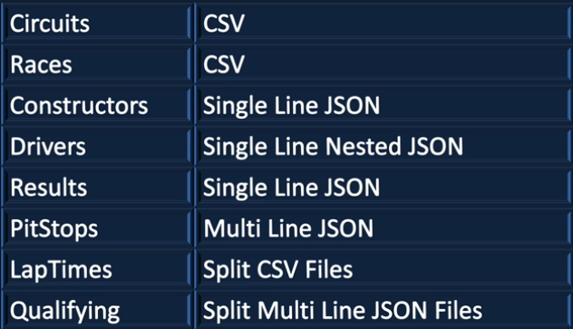
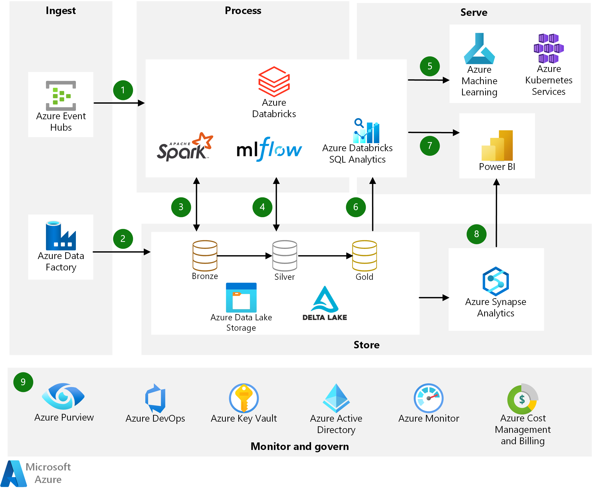
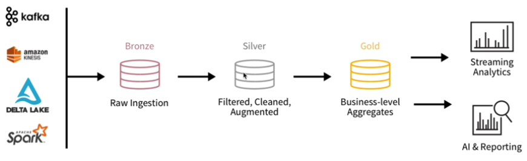
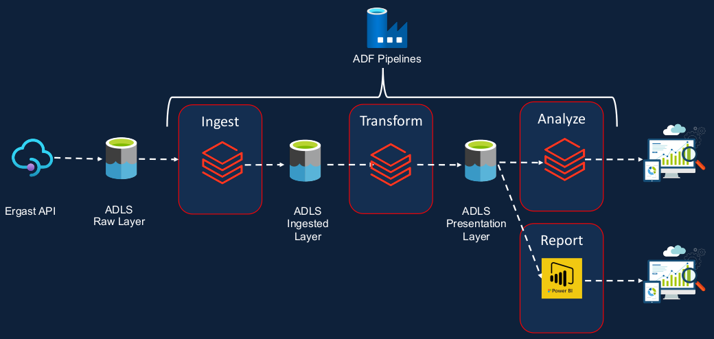
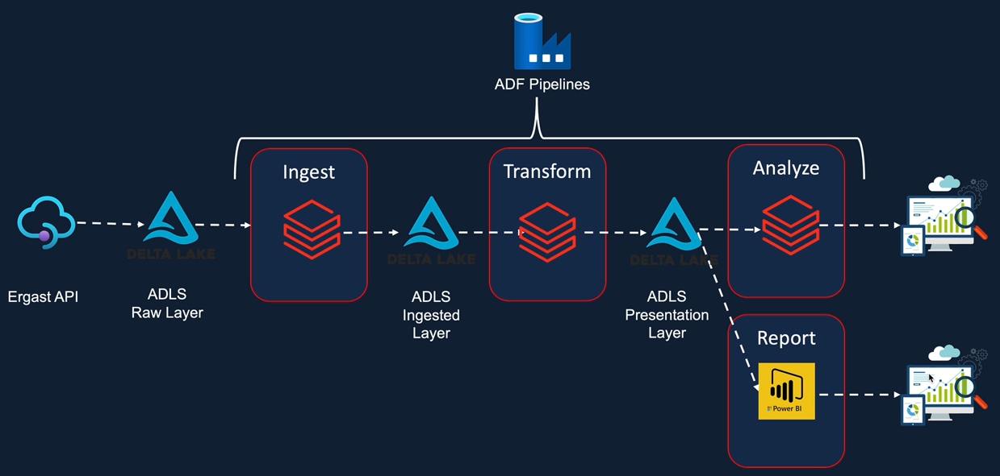

# **formula1** project 

> Data Engineer project using Azure Data Factory, SQL, Data Lake, Databricks, HDInsight, CI/CD based on **Formula1 Racing** datasets

 

## **Goals** (learn / gain / acquire)

- How to create notebooks, dashboards, clusters, cluster pools and jobs in Azure Databricks
- How to transform and analyse data using Spark SQL in Azure Databricks
- How to create Azure Data Factory pipelines to execute Databricks notebooks
- The skills required around Azure Databricks and Data Factory to pass the Azure Data Engineer Associate certification exam DP203
- A comprehensive understanding about Unity Catalog and the data governance capabilities offered by Unity Catalog
- Acquire professional level data engineering skills in Azure Databricks, Delta Lake, Spark Core, Azure Data Lake Gen2 and Azure Data Factory (ADF)
- How to ingest and transform data using PySpark in Azure Databricks
- About Data Lake architecture and Lakehouse Architecture.
- How to implement a Lakehouse architecture using Delta Lake
- How to create Azure Data Factory triggers to schedule pipelines as well as monitor them
- How to connect to Azure Databricks from PowerBI to create reports
- To implement a data governance solution using Unity Catalog enabled Databricks workspace

 

## **Description**

- Formula1 season happens once a year, roughly over 20 races
- Each race happens over a weekend
- There are various race circuits
- There are roughly ten teams that participate in each season and they are also called constructors in Formula1
- Each team has two drivers and each driver is assigned a specific car
- There are also reserve drivers in each team, but only to participate in races
- Raceway can spans from Friday to Sunday.
- There are two practice sessions on a Friday and a final practice session on Saturday morning. They don't count towards any points or achievements
- There is a qualifying session on Saturday afternoon and it happens over three different stages.
- The qualifying results decide the grid position of the driver as to where he'll start the race.
- The qualifying results decide the grid position of the driver as to where he'll start the race. The higher the driver qualifies the forward, he gets to start the race, which is a massive advantage
- Unlike qualifying sessions, which are decided over a single lap, races span multiple laps, roughly between 50 and 70 laps, depending on the length of the circuit
- Also during the race, drivers make pit stops to change the tires or to replace the damaged car
- Based on the race results. Drivers and constructors standings are decided. Whichever driver is on the top of the standings at the end of the season is the drivers champion. And similarly, the team that's leading the constructors standings becomes the Constructors champion

 

## Formula1 data source & datasets

- There is the third party developer API called Ergast that makes the data available for all races from 1950 onwards.
- So let's visit the website and explore it a bit further. In order to get to the documentation, visit the [Ergast website](http://ergast.com/mrd/). And from here you can look at things like terms and conditions of use and the API documentation itself. And also if we didn't want to use the API, we can look at the manual interface or even download the data in a CSV format.
- You can use this API for personal non-commercial applications and services, including educational and research purposes. So we are okay to use this data from this API or from this website for our educational purposes.
- [main page > Database Images> CSV Database Tables](http://ergast.com/mrd/db/) 
  - [f1db_csv.zip](http://ergast.com/downloads/f1db.sql.gz) :  the zip file contains all the data in a CSV format. So that includes all the race data starting from 1950 onwards up to now.
- Files converted in different formats to deal with different file types

- The structure of the database is shown in an [Entity Relationship Diagram](http://ergast.com/images/ergast_db.png) and explained in the [Database User Guide](http://ergast.com/docs/f1db_user_guide.txt)

 

## **Prepare the data for the project**

## **Project Requirements**

### Data Ingestion Requirements

  - [ ] Ingest All 8 files into the data lake
  - [ ] Ingested data must have the schema applied
  - [ ] Ingested data must have audit columns
  - [ ] Ingested data must be stored in columnar format (i.e., Parquet)
  - [ ] Must be able to analyze the ingested data via SQL
  - [ ] Ingestion logic must be able to handle incremental load

### Data Transformation Requirements

  - [ ] Join the key information required for reporting to create a new table
  - [ ] Join the key information required for Analysis to create a new table
  - [ ] Transformed tables must have audit columns
  - [ ] Must be able to analyze the transformed data via SQL
  - [ ] Transformed data must be stored in columnar format (i.e., Parquet)
  - [ ] Transformation logic must be able to handle incremental load

### Reporting Requirements

  - [ ] Driver Standings
  - [ ] Constructor Standings

### Analysis Requirements

  - [ ] Dominant Drivers
  - [ ] Dominant Teams
  - [ ] Visualize the outputs
  - [ ] Create Databricks Dashboards

### Scheduling Requirements

  - [ ] Pipeline to run every Sunday 10 PM
  - [ ] Ability to monitor pipelines
  - [ ] Ability to re-run failed pipelines
  - [ ] Ability to set-up alerts on failures

### Other Non-Functional Requirements

  - [ ] Ability to delete individual records
  - [ ] Ability to see history and time travel
  - [ ] Ability to roll back to a previous version

 

## **Solution Architecture**

### Azure Databricks Modern Analytics Architecture

The solution used in this project is based on the [Modern analytics architecture with Azure Databricks](https://learn.microsoft.com/en-us/azure/architecture/solution-ideas/articles/azure-databricks-modern-analytics-architecture) from the [Azure Architecture Center](https://learn.microsoft.com/en-us/azure/architecture/) ...

### Databricks Architecture

.. and from [Databricks Architecture Solutions](https://www.databricks.com/solutions/data-engineering)

### Solution Architecture

- **Ergast API** : The Ergast API serves as the primary data source for Formula 1 racing data
- **ADLS RAW layer** : The data from the Ergast API is ingested into the Azure Data Lake Storage (ADLS) RAW layer, which acts as the initial storage layer for the raw data
- **Ingest (Databricks Spark)** : Using Databricks Spark, the data is ingested from the ADLS RAW layer, performing necessary data transformations and cleaning operations
- **ADLS ingest layer** : The transformed data is stored in the ADLS ingest layer, serving as an intermediate storage layer for further processing
- **Transform (Databricks Spark)** : Databricks Spark is used again to perform additional data transformations and aggregations on the data stored in the ADLS ingest layer
- **ADLS presentation layer** : The transformed and processed data is stored in the ADLS presentation layer, providing a structured and optimized format for analysis
- **Analysis (Databricks)** : Leveraging the power of Databricks, the data in the ADLS presentation layer is analyzed using various analytical techniques and algorithms
- **ADLS presentation layer to Power BI** : The analyzed data from the ADLS presentation layer is visualized and presented using Power BI for intuitive and interactive data exploration

 

## **Stack**

- [Python](https://www.python.org/)
- [PySpark](https://spark.apache.org/docs/latest/api/python/)
- [Azure Databricks](https://azure.microsoft.com/en-us/products/databricks/)
- [Azure Data Factory (ADF)](https://azure.microsoft.com/en-us/products/data-factory)
- [Azure Data Lake Storage Gen2 (ADLS)](https://azure.microsoft.com/en-us/solutions/data-lake/)
- [Delta Lake](https://learn.microsoft.com/en-us/azure/databricks/delta/)

## **Project Structure**

- **data**_________: contains sample raw data from Ergast API.
- **set-up**_______: notebooks to mount ADLS storages (raw, ingested, presentaton) in Databricks
- **raw**__________:  contains SQL file to create ingested tables using Spark SQL
- **ingestion**____: contains notebooks to ingest all the data files from raw layer to ingested layer. Handles the incremental data for files results, pitstopes, laptimes and qualifying.
- **transform**____: contains notebooks to transform the data from ingested layer to presentation layer. Notebook performs transformations to setup for analysis
- **analysis**_____: contains SQL files for finding the dominant drivers and teams and to prepare the results for visualization
- **includes**_____: includes notebooks containing helper functions used in transformations
- **utils**________: contains SQL file to drop all databases for incremental load

